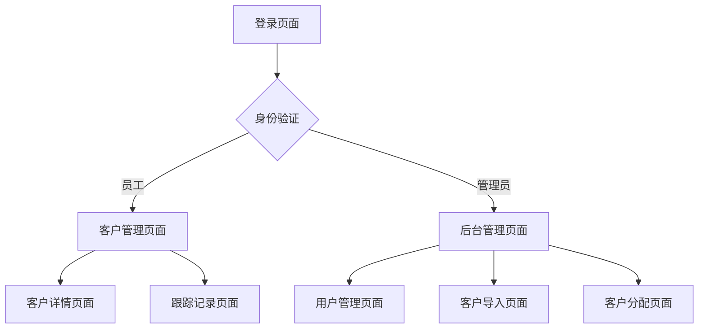

## 1. 产品概述
CRM客户管理系统，帮助企业员工管理客户信息和跟踪记录。员工只能查看和编辑自己的客户数据，管理员可以管理用户权限和批量导入客户数据。

目标用户：销售团队、客户经理、系统管理员
市场价值：提升客户管理效率，确保数据安全隔离，简化销售流程。

## 2. 核心功能

### 2.1 用户角色
| 角色 | 注册方式 | 核心权限 |
|------|----------|----------|
| 员工 | 管理员创建账号 | 查看和编辑自己的客户、记录跟踪情况 |
| 管理员 | 系统初始化创建 | 用户管理、权限管理、客户批量导入、分配客户 |

### 2.2 功能模块
系统主要包含以下页面：
1. **登录页面**：员工账号密码登录
2. **客户管理页面**：客户列表、客户详情编辑、跟踪记录
3. **后台管理页面**：用户管理、权限设置、客户导入

### 2.3 页面详情
| 页面名称 | 模块名称 | 功能描述 |
|----------|----------|----------|
| 登录页面 | 登录表单 | 输入用户名密码，验证身份后进入系统 |
| 客户管理页面 | 客户列表 | 显示当前登录员工的客户列表，支持搜索和筛选 |
| 客户管理页面 | 客户详情 | 查看客户基本信息，编辑客户资料 |
| 客户管理页面 | 跟踪记录 | 添加、编辑、删除客户跟踪记录，按时间倒序显示 |
| 后台管理页面 | 用户管理 | 创建员工账号、重置密码、启用/禁用账号 |
| 后台管理页面 | 权限管理 | 设置员工权限级别、分配客户权限 |
| 后台管理页面 | 客户导入 | 上传CSV/Excel文件批量导入客户数据 |
| 后台管理页面 | 客户分配 | 将客户分配给指定员工跟踪 |

## 3. 核心流程

### 员工使用流程
员工通过用户名密码登录系统，进入客户管理页面查看自己的客户列表。可以点击客户查看详情，编辑客户信息，添加跟踪记录。系统确保员工只能看到分配给自己的客户数据。

### 管理员使用流程
管理员登录后可以进入后台管理，创建新员工账号，设置权限，批量导入客户数据，并将客户分配给指定员工。

## 4. 用户界面设计

### 4.1 设计风格
- 主色调：蓝色系（#1890ff）体现专业性
- 辅助色：灰色系（#f5f5f5）用于背景和边框
- 按钮样式：圆角矩形，主要按钮使用主色调
- 字体：系统默认字体，标题16px，正文14px
- 布局：左侧导航栏 + 右侧内容区域的经典后台布局
- 图标：使用简洁的线性图标风格

### 4.2 页面设计概览
| 页面名称 | 模块名称 | UI元素 |
|----------|----------|--------|
| 登录页面 | 登录表单 | 居中卡片布局，包含logo、用户名密码输入框、登录按钮 |
| 客户管理页面 | 客户列表 | 表格展示客户信息，顶部搜索栏和筛选条件，操作按钮 |
| 客户详情页面 | 信息编辑 | 表单布局展示客户详细信息，可编辑保存 |
| 跟踪记录页面 | 记录列表 | 时间轴样式展示跟踪历史，底部添加新记录输入框 |
| 后台管理页面 | 用户列表 | 表格展示员工账号，包含状态标识和操作按钮 |
| 客户导入页面 | 文件上传 | 拖拽上传区域，显示导入进度和结果 |

### 4.3 响应式设计
采用桌面端优先设计，适配主流浏览器。在平板和手机上保持基本功能可用，采用响应式表格和折叠式导航。

### 4.4 数据安全
- 员工只能访问分配给自己的客户数据
- 管理员可以查看所有客户数据
- 所有操作都有权限验证
- 客户数据支持导出备份