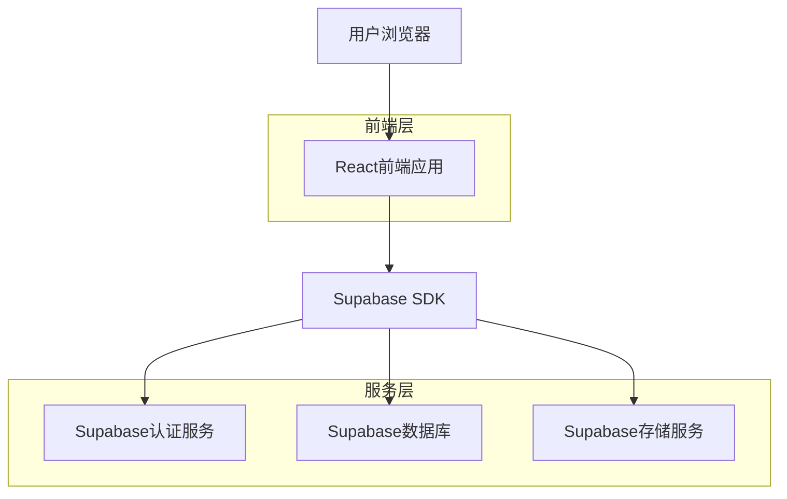
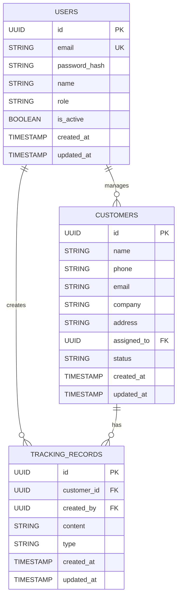

## 1. 架构设计



## 2. 技术描述

- 前端：React@18 + TailwindCSS@3 + Vite
- 初始化工具：vite-init
- 后端：Supabase（提供认证、数据库、存储服务）
- 状态管理：React Context + useReducer
- 路由：React Router@6
- UI组件库：Ant Design@5

## 3. 路由定义

| 路由 | 用途 |
|------|------|
| /login | 登录页面，员工和管理员身份验证 |
| /dashboard | 员工客户管理主页面 |
| /customer/:id | 客户详情页面，查看和编辑客户信息 |
| /admin/users | 后台用户管理页面 |
| /admin/import | 客户批量导入页面 |
| /admin/assign | 客户分配管理页面 |

## 4. 数据模型

### 4.1 数据模型定义



### 4.2 数据定义语言

用户表 (users)
```sql
-- 创建用户表
CREATE TABLE users (
    id UUID PRIMARY KEY DEFAULT gen_random_uuid(),
    email VARCHAR(255) UNIQUE NOT NULL,
    password_hash VARCHAR(255) NOT NULL,
    name VARCHAR(100) NOT NULL,
    role VARCHAR(20) DEFAULT 'employee' CHECK (role IN ('admin', 'employee')),
    is_active BOOLEAN DEFAULT true,
    created_at TIMESTAMP WITH TIME ZONE DEFAULT NOW(),
    updated_at TIMESTAMP WITH TIME ZONE DEFAULT NOW()
);

-- 创建索引
CREATE INDEX idx_users_email ON users(email);
CREATE INDEX idx_users_role ON users(role);
```

客户表 (customers)
```sql
-- 创建客户表
CREATE TABLE customers (
    id UUID PRIMARY KEY DEFAULT gen_random_uuid(),
    name VARCHAR(100) NOT NULL,
    phone VARCHAR(20),
    email VARCHAR(255),
    company VARCHAR(200),
    address TEXT,
    assigned_to UUID REFERENCES users(id),
    status VARCHAR(20) DEFAULT 'active' CHECK (status IN ('active', 'inactive', 'potential')),
    created_at TIMESTAMP WITH TIME ZONE DEFAULT NOW(),
    updated_at TIMESTAMP WITH TIME ZONE DEFAULT NOW()
);

-- 创建索引
CREATE INDEX idx_customers_assigned_to ON customers(assigned_to);
CREATE INDEX idx_customers_status ON customers(status);
```

跟踪记录表 (tracking_records)
```sql
-- 创建跟踪记录表
CREATE TABLE tracking_records (
    id UUID PRIMARY KEY DEFAULT gen_random_uuid(),
    customer_id UUID REFERENCES customers(id) ON DELETE CASCADE,
    created_by UUID REFERENCES users(id),
    content TEXT NOT NULL,
    type VARCHAR(50) DEFAULT 'note' CHECK (type IN ('note', 'call', 'meeting', 'email')),
    created_at TIMESTAMP WITH TIME ZONE DEFAULT NOW(),
    updated_at TIMESTAMP WITH TIME ZONE DEFAULT NOW()
);

-- 创建索引
CREATE INDEX idx_tracking_customer_id ON tracking_records(customer_id);
CREATE INDEX idx_tracking_created_by ON tracking_records(created_by);
CREATE INDEX idx_tracking_created_at ON tracking_records(created_at DESC);
```

### 4.3 权限策略

员工只能访问自己的客户数据：
```sql
-- 客户数据访问策略
CREATE POLICY "员工只能查看自己的客户" ON customers
    FOR SELECT
    USING (assigned_to = auth.uid());

-- 跟踪记录访问策略
CREATE POLICY "员工只能查看自己客户的跟踪记录" ON tracking_records
    FOR SELECT
    USING (
        EXISTS (
            SELECT 1 FROM customers 
            WHERE customers.id = tracking_records.customer_id 
            AND customers.assigned_to = auth.uid()
        )
    );
```

管理员拥有所有权限：
```sql
-- 管理员拥有所有权限
CREATE POLICY "管理员拥有所有权限" ON customers
    FOR ALL
    USING (
        EXISTS (
            SELECT 1 FROM users 
            WHERE users.id = auth.uid() 
            AND users.role = 'admin'
        )
    );
```

## 5. 安全考虑

- 使用Supabase内置的认证系统
- 数据库行级安全策略确保数据隔离
- 所有API调用都经过身份验证
- 敏感操作需要管理员权限
- 客户数据支持导出备份