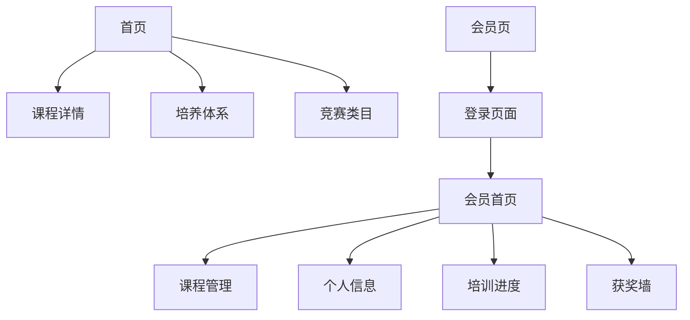

## 1. 产品概述
中国青少年无人机科学素养培训网站是一个专注于通过无人机教育提升青少年科学素养的在线教育平台。网站采用"首页+会员区"的双层结构，为访客提供直观的课程展示，为学员提供完整的培训管理服务。

通过视觉化的导航设计和系统化的会员管理，实现从课程了解到培训管理的完整用户体验，培养学生的科技创新能力和实践操作能力。

## 2. 核心功能

### 2.1 用户角色
| 角色 | 注册方式 | 核心权限 |
|------|----------|----------|
| 访客用户 | 无需注册 | 浏览首页内容、通过图片/视频链接查看课程介绍 |
| 学员用户 | 用户名/密码登录 | 访问会员区、管理个人课程、查看培训进度、维护获奖信息 |

### 2.2 功能模块
网站采用双层页面结构：
1. **首页**：作为着陆页，通过视觉化入口引导用户了解课程详情、培养体系和竞赛类目。
2. **会员页**：提供用户名密码登录，登录后可访问课程管理、个人信息、培训进度和获奖墙等功能。

### 2.3 页面详情
| 页面名称 | 模块名称 | 功能描述 |
|----------|----------|----------|
| 首页 | 视觉导航区 | 通过图片和视频链接提供三个主要入口：课程详情、培养体系、竞赛类目介绍 |
| 课程详情页 | 课程展示模块 | 详细介绍各级别无人机课程内容、学习目标、适合年龄段和课程优势 |
| 培养体系页 | 体系介绍模块 | 可视化展示从零基础到专业级别的完整培养路径和教学理念 |
| 竞赛类目页 | 竞赛介绍模块 | 展示可参与的无人机竞赛类型、认证体系和参赛特权 |
| 会员登录页 | 身份验证模块 | 提供用户名和密码登录界面，支持记住登录状态 |
| 课程管理页 | 课程列表模块 | 显示已报名课程、课程进度、作业提交和学习资源下载 |
| 个人信息页 | 资料维护模块 | 编辑个人基本信息、联系方式、修改密码和头像上传 |
| 培训进度页 | 进度跟踪模块 | 可视化展示学习进度、技能掌握情况、下一阶段学习目标 |
| 参赛获奖墙 | 成就展示模块 | 展示参赛记录、获奖证书、比赛照片和荣誉积分 |

## 3. 核心流程

### 访客浏览流程
访客访问首页，通过图片或视频入口了解课程详情、培养体系和竞赛信息。每个入口都提供丰富的视觉内容和详细介绍，帮助访客全面了解培训价值。

### 学员使用流程
学员通过用户名密码登录后，可以管理个人课程、查看学习进度、更新个人信息和维护获奖记录。所有功能都围绕学员的培训体验进行设计。

## 4. 用户界面设计

### 4.1 设计风格
- **主色调**：科技蓝(#0066CC)搭配活力橙(#FF6600)，体现科技感和青春活力
- **按钮样式**：圆角矩形设计，悬停时有轻微阴影效果，增强交互感
- **字体选择**：标题使用思源黑体，正文使用微软雅黑，确保中文显示效果
- **布局风格**：首页采用视觉卡片式布局，会员区采用功能模块式布局
- **图标风格**：使用扁平化设计的科技教育类图标，简洁易懂

### 4.2 页面设计概览
| 页面名称 | 模块名称 | UI元素 |
|----------|----------|--------|
| 首页 | 视觉导航区 | 三个大尺寸卡片，分别展示课程、体系、竞赛的精美图片和简短视频预览 |
| 课程详情页 | 内容展示区 | 采用图文并茂的方式，配合学员作品照片和课程实景展示 |
| 会员登录页 | 登录表单 | 简洁的用户名密码输入框，支持记住密码和自动登录功能 |
| 课程管理页 | 课程卡片 | 网格布局显示各课程进度条、完成状态和快速操作按钮 |
| 培训进度页 | 进度可视化 | 使用进度条、技能雷达图和学习路径图展示学习成果 |
| 获奖墙 | 成就展示 | 证书墙形式展示获奖记录，支持上传新证书和分享功能 |

### 4.3 响应式设计
采用桌面端优先的设计策略，确保在1920x1080分辨率下的最佳显示效果。同时适配平板和移动设备：
- 平板端：保持视觉导航的完整性，优化触摸操作体验
- 手机端：首页采用垂直堆叠布局，会员区使用底部导航栏
- 图片和视频内容会根据屏幕尺寸自动调整，确保在各种设备上都有良好的视觉体验