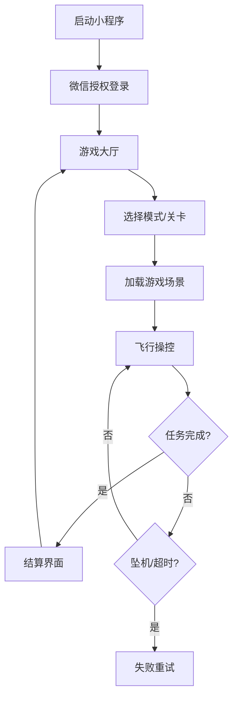

# 青少年无人机飞行挑战 (WeChat Mini Program Game) - PRD

## 1. 产品概述
本项目是一款基于微信小程序的**无人机模拟操控游戏**，旨在通过趣味性的飞行体验和挑战任务，激发青少年对无人机科技的兴趣。不同于传统的在线课程学习，本产品侧重于"玩中学"，让用户在模拟飞行中掌握基础的操控逻辑（如油门、俯仰、横滚、偏航）。

## 2. 核心价值
- **兴趣引导**：通过游戏化的方式打破无人机学习的枯燥感。
- **低门槛体验**：无需购买昂贵的实体无人机，手机即可体验飞行乐趣。
- **即时反馈**：通过关卡评分和排行榜给予用户成就感。

## 3. 用户角色
- **玩家**：所有微信用户，无需注册，授权头像昵称即可开始游戏。

## 4. 功能模块架构

### 4.1 游戏大厅 (Home)
- **开始飞行**：进入关卡选择地图。
- **我的机库**：查看已解锁的无人机模型（外观皮肤）。
- **排行榜**：查看好友或全服的飞行分数/过关时间排名。
- **设置**：音效开关、操作模式切换（美国手/日本手）。

### 4.2 飞行模拟器 (Game Core)
这是小程序的核心功能，基于 Canvas 渲染。

- **操作界面 (HUD)**
  - **左摇杆**：控制高度 (Throttle) 和 转向 (Yaw)。
  - **右摇杆**：控制前后 (Pitch) 和 左右平移 (Roll)。
  - **状态栏**：显示当前高度、速度、电池电量（倒计时）、任务目标。
  
- **游戏模式**
  1.  **自由飞行 (Free Flight)**：
      - 无限制、无任务，在城市或野外地图自由探索。
      - 适合新手练习手感。
  2.  **挑战模式 (Challenge Mode)**：
      - **Level 1 - 起飞与降落**：控制无人机平稳起飞并停在指定停机坪。
      - **Level 2 - 空中钻圈**：按照指示箭头穿越空中的圆环，不能触碰边缘。
      - **Level 3 - 搜救任务**：在限定时间内找到地图上的目标点并悬停拍照。
  
- **物理反馈**
  - 简单的惯性模拟。
  - 碰撞检测（撞墙、撞树导致坠机重置）。
  - 风力干扰（高级关卡）。

### 4.3 结算与成就 (Result & Profile)
- **关卡结算**：根据耗时、碰撞次数、完成度评级（1-3星）。
- **积分系统**：通关获得积分，用于解锁新的无人机皮肤。
- **荣誉勋章**：达成特定条件（如"无伤通关"）获得虚拟勋章。

## 5. 核心流程图

## 6. 界面风格
- **视觉风格**：低多边形 (Low Poly) 或 2D 扁平卡通风，色彩明亮，符合青少年审美。
- **交互音效**：在此基础上增加螺旋桨嗡嗡声、金币收集音效、通关胜利音乐。

## 7. 微信能力集成
- **分享**：邀请好友挑战特定关卡。
- **排行榜**：微信开放数据域排行榜。
- **触感反馈**：撞击或获得道具时手机震动。
