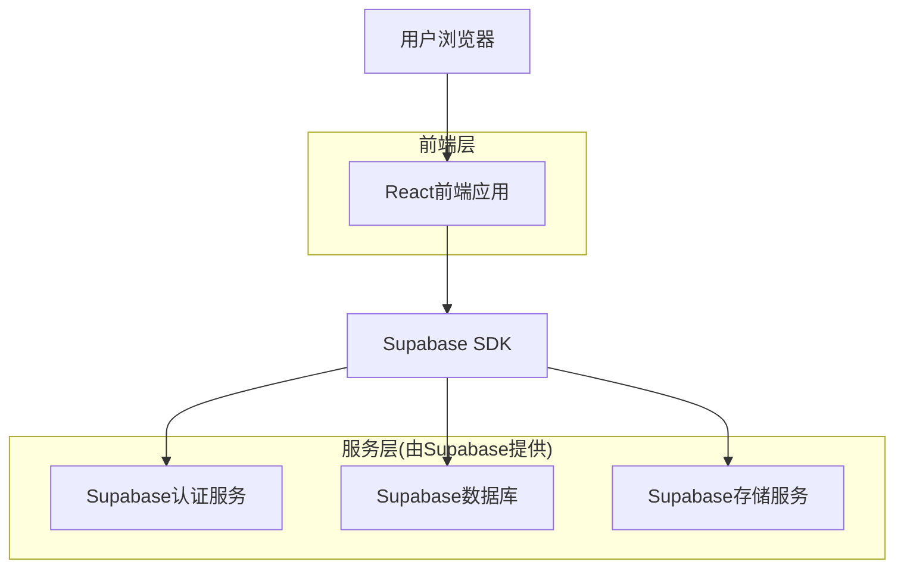
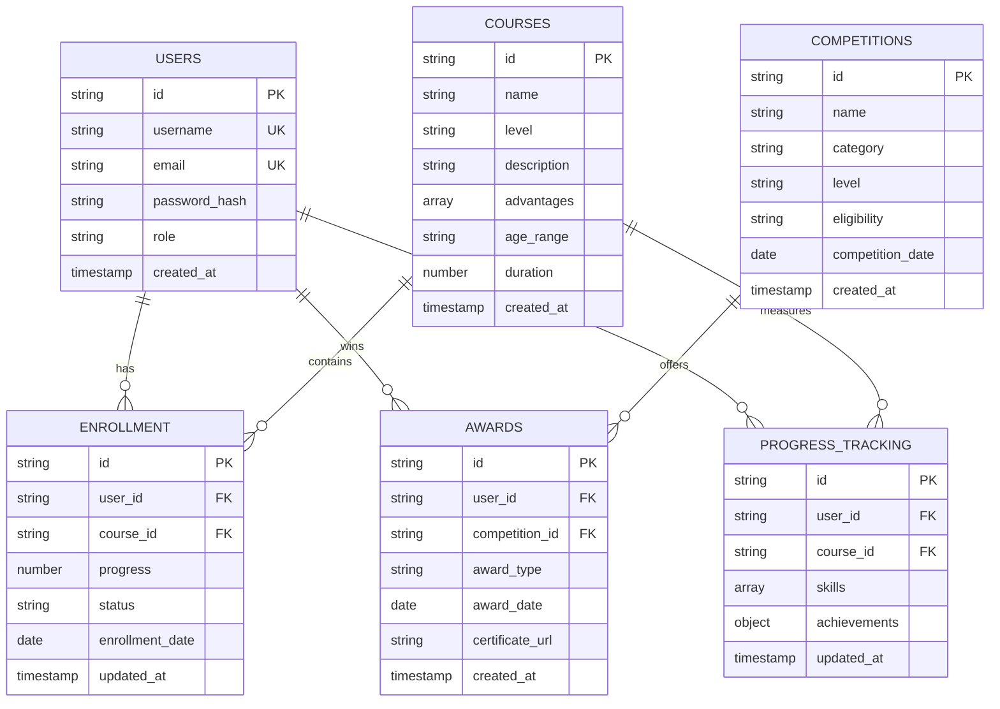

## 1. 架构设计



## 2. 技术描述

- **前端**: React@18 + tailwindcss@3 + vite
- **初始化工具**: vite-init
- **后端**: Supabase (BaaS)
- **数据库**: Supabase PostgreSQL
- **身份认证**: Supabase Auth
- **文件存储**: Supabase Storage

## 3. 路由定义

| 路由 | 用途 |
|------|------|
| / | 首页，通过图片/视频链接导航到三个子页面 |
| /courses/detail | 课程详情页，详细介绍各级别课程内容 |
| /training/system | 培养体系页，展示完整的培养路径和教学理念 |
| /competitions/categories | 竞赛类目页，介绍各类竞赛和参赛特权 |
| /member/login | 会员登录页，用户名密码身份验证 |
| /member/dashboard | 会员首页，登录后的功能导航中心 |
| /member/courses | 课程管理页，管理已报名课程和学习进度 |
| /member/profile | 个人信息页，维护个人资料和账户设置 |
| /member/progress | 培训进度页，跟踪学习进度和技能掌握 |
| /member/awards | 获奖墙页面，展示参赛获奖记录和证书 |

## 4. API定义

### 4.1 公开内容API

**获取课程详情**
```
GET /api/courses/detail
```

响应参数：
| 参数名称 | 参数类型 | 描述 |
|----------|----------|------|
| courses | array | 课程列表 |
| courses.id | string | 课程ID |
| courses.name | string | 课程名称 |
| courses.level | string | 课程级别(basic/intermediate/advanced) |
| courses.description | string | 课程详细介绍 |
| courses.advantages | array | 课程优势和特色 |

**获取培养体系**
```
GET /api/training/system
```

响应参数：
| 参数名称 | 参数类型 | 描述 |
|----------|----------|------|
| system_path | array | 培养路径阶段 |
| system_path.stage | string | 阶段名称 |
| system_path.description | string | 阶段描述 |
| system_path.duration | string | 阶段时长 |

**获取竞赛类目**
```
GET /api/competitions/categories
```

响应参数：
| 参数名称 | 参数类型 | 描述 |
|----------|----------|------|
| categories | array | 竞赛分类列表 |
| categories.id | string | 分类ID |
| categories.name | string | 竞赛类型名称 |
| categories.privileges | array | 参赛特权和优势 |

### 4.2 会员功能API

**用户登录**
```
POST /api/auth/login
```

请求参数：
| 参数名称 | 参数类型 | 必需 | 描述 |
|----------|----------|------|------|
| username | string | 是 | 用户名 |
| password | string | 是 | 密码 |

**获取会员课程**
```
GET /api/member/courses
```

需要认证，响应参数：
| 参数名称 | 参数类型 | 描述 |
|----------|----------|------|
| enrolled_courses | array | 已报名课程 |
| enrolled_courses.progress | number | 学习进度百分比 |
| enrolled_courses.status | string | 课程状态 |

**更新个人信息**
```
PUT /api/member/profile
```

**上传获奖证书**
```
POST /api/member/awards/upload
```

## 5. 数据模型

### 5.1 数据模型定义



### 5.2 数据定义语言

**用户表 (users)**
```sql
-- 创建用户表
CREATE TABLE users (
    id UUID PRIMARY KEY DEFAULT gen_random_uuid(),
    username VARCHAR(50) UNIQUE NOT NULL,
    email VARCHAR(255) UNIQUE NOT NULL,
    password_hash VARCHAR(255) NOT NULL,
    role VARCHAR(20) DEFAULT 'student' CHECK (role IN ('student', 'admin')),
    created_at TIMESTAMP WITH TIME ZONE DEFAULT NOW(),
    updated_at TIMESTAMP WITH TIME ZONE DEFAULT NOW()
);

-- 创建索引
CREATE INDEX idx_users_username ON users(username);
CREATE INDEX idx_users_email ON users(email);
CREATE INDEX idx_users_role ON users(role);
```

**课程表 (courses)**
```sql
-- 创建课程表
CREATE TABLE courses (
    id UUID PRIMARY KEY DEFAULT gen_random_uuid(),
    name VARCHAR(200) NOT NULL,
    level VARCHAR(20) CHECK (level IN ('basic', 'intermediate', 'advanced')),
    description TEXT,
    advantages TEXT[],
    age_range VARCHAR(50),
    duration INTEGER,
    created_at TIMESTAMP WITH TIME ZONE DEFAULT NOW(),
    updated_at TIMESTAMP WITH TIME ZONE DEFAULT NOW()
);

-- 创建索引
CREATE INDEX idx_courses_level ON courses(level);
```

**报名记录表 (enrollments)**
```sql
-- 创建报名记录表
CREATE TABLE enrollments (
    id UUID PRIMARY KEY DEFAULT gen_random_uuid(),
    user_id UUID REFERENCES users(id) ON DELETE CASCADE,
    course_id UUID REFERENCES courses(id) ON DELETE CASCADE,
    progress DECIMAL(5,2) DEFAULT 0.00,
    status VARCHAR(20) DEFAULT 'active' CHECK (status IN ('active', 'completed', 'paused')),
    enrollment_date DATE DEFAULT CURRENT_DATE,
    updated_at TIMESTAMP WITH TIME ZONE DEFAULT NOW(),
    UNIQUE(user_id, course_id)
);

-- 创建索引
CREATE INDEX idx_enrollments_user_id ON enrollments(user_id);
CREATE INDEX idx_enrollments_course_id ON enrollments(course_id);
CREATE INDEX idx_enrollments_status ON enrollments(status);
```

**竞赛表 (competitions)**
```sql
-- 创建竞赛表
CREATE TABLE competitions (
    id UUID PRIMARY KEY DEFAULT gen_random_uuid(),
    name VARCHAR(200) NOT NULL,
    category VARCHAR(100),
    level VARCHAR(50),
    eligibility TEXT,
    competition_date DATE,
    description TEXT,
    created_at TIMESTAMP WITH TIME ZONE DEFAULT NOW()
);

-- 创建索引
CREATE INDEX idx_competitions_category ON competitions(category);
CREATE INDEX idx_competitions_date ON competitions(competition_date);
```

**获奖记录表 (awards)**
```sql
-- 创建获奖记录表
CREATE TABLE awards (
    id UUID PRIMARY KEY DEFAULT gen_random_uuid(),
    user_id UUID REFERENCES users(id) ON DELETE CASCADE,
    competition_id UUID REFERENCES competitions(id) ON DELETE CASCADE,
    award_type VARCHAR(100),
    award_date DATE,
    certificate_url VARCHAR(500),
    created_at TIMESTAMP WITH TIME ZONE DEFAULT NOW()
);

-- 创建索引
CREATE INDEX idx_awards_user_id ON awards(user_id);
CREATE INDEX idx_awards_competition_id ON awards(competition_id);
CREATE INDEX idx_awards_date ON awards(award_date);
```

**学习进度表 (progress_tracking)**
```sql
-- 创建学习进度表
CREATE TABLE progress_tracking (
    id UUID PRIMARY KEY DEFAULT gen_random_uuid(),
    user_id UUID REFERENCES users(id) ON DELETE CASCADE,
    course_id UUID REFERENCES courses(id) ON DELETE CASCADE,
    skills JSONB,
    achievements JSONB,
    updated_at TIMESTAMP WITH TIME ZONE DEFAULT NOW(),
    UNIQUE(user_id, course_id)
);

-- 创建索引
CREATE INDEX idx_progress_user_id ON progress_tracking(user_id);
CREATE INDEX idx_progress_course_id ON progress_tracking(course_id);
```

### 5.3 访问权限设置

```sql
-- 基础读取权限授予匿名用户(公开内容)
GRANT SELECT ON courses TO anon;
GRANT SELECT ON competitions TO anon;

-- 完整权限授予认证用户(会员功能)
GRANT ALL PRIVILEGES ON enrollments TO authenticated;
GRANT ALL PRIVILEGES ON awards TO authenticated;
GRANT ALL PRIVILEGES ON progress_tracking TO authenticated;
GRANT SELECT ON users TO authenticated;
GRANT UPDATE (email) ON users TO authenticated;

-- 行级安全策略
ALTER TABLE enrollments ENABLE ROW LEVEL SECURITY;
ALTER TABLE awards ENABLE ROW LEVEL SECURITY;
ALTER TABLE progress_tracking ENABLE ROW LEVEL SECURITY;
ALTER TABLE users ENABLE ROW LEVEL SECURITY;

-- 用户只能查看和修改自己的数据
CREATE POLICY "用户只能查看自己的报名记录" ON enrollments
    FOR ALL TO authenticated
    USING (auth.uid() = user_id);

CREATE POLICY "用户只能查看和修改自己的获奖记录" ON awards
    FOR ALL TO authenticated
    USING (auth.uid() = user_id);

CREATE POLICY "用户只能查看和修改自己的学习进度" ON progress_tracking
    FOR ALL TO authenticated
    USING (auth.uid() = user_id);

CREATE POLICY "用户只能修改自己的用户信息" ON users
    FOR UPDATE TO authenticated
    USING (auth.uid() = id);
```